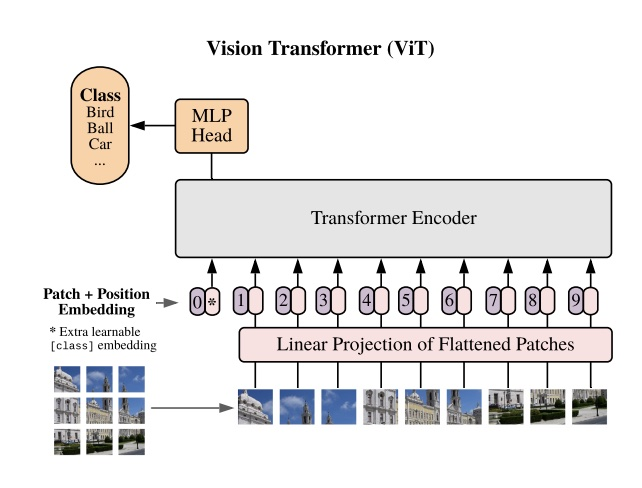

# Multi-Head Attention and Vision Transformer From Scratch


This repository includes code which aims to reimplement the Multi-Head Attention Architecture from Vaswani et al's paper: [Attention Is All You Need](https://www.google.com/url?sa=t&source=web&rct=j&opi=89978449&url=https://arxiv.org/abs/1706.03762&ved=2ahUKEwj0kNChrIiFAxXD48kDHUuiAy8QFnoECAcQAQ&usg=AOvVaw2ceXGQohV5Kx51VSkfkG08) and the Vision Transformer Architecture (VIT) from Dosovitskiy et al's paper: [An Image is Worth 16x16 Words: Transformers for Image Recognition at Scale](https://arxiv.org/abs/2010.11929) using only PyTorch 

To evaluate the implementations, my implementation of the VIT was compared against Phillip Lippe's [implementation](https://uvadlc-notebooks.readthedocs.io/en/latest/tutorial_notebooks/tutorial15/Vision_Transformer.html) through training and testing on the Fashion MNIST dataset 

To run the code (see imported packages in fashion_mnist_benchmark.py for relevant dependencies):

```
$ python fashion_mnist_benchmark.py 
```

Average test results over 5 training runs:

```
My VIT: 0.87496 +- 0.0037
Other VIT: 0.86976 +- 0.0062
```